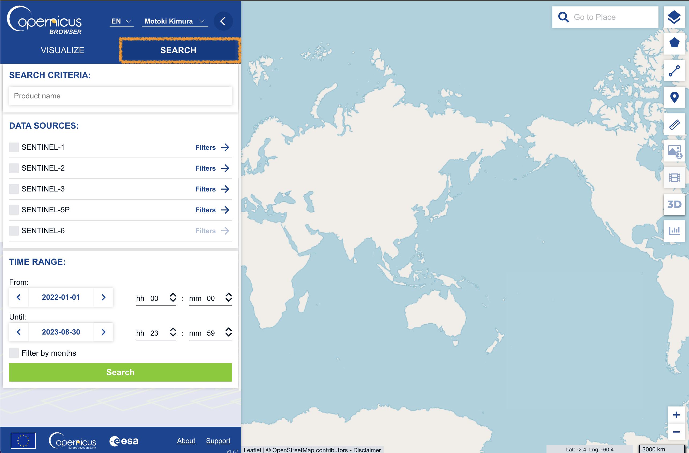
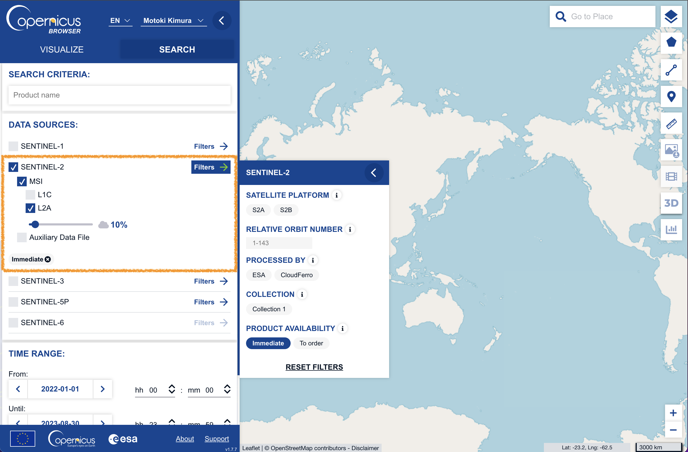
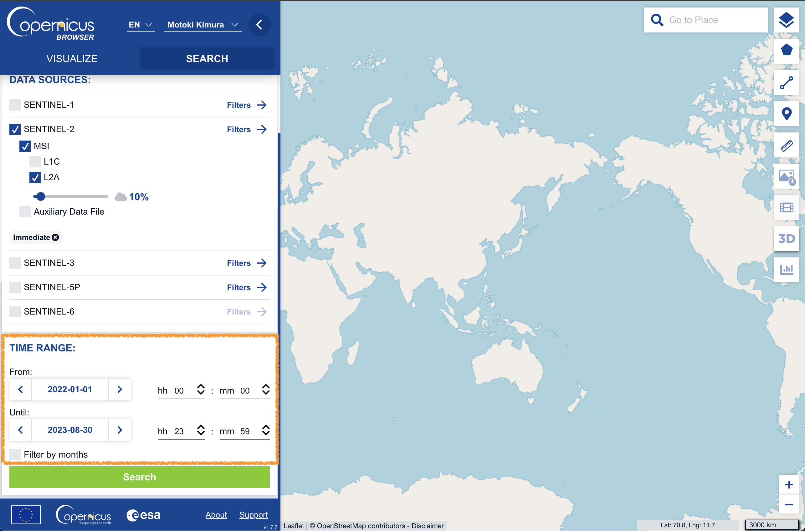
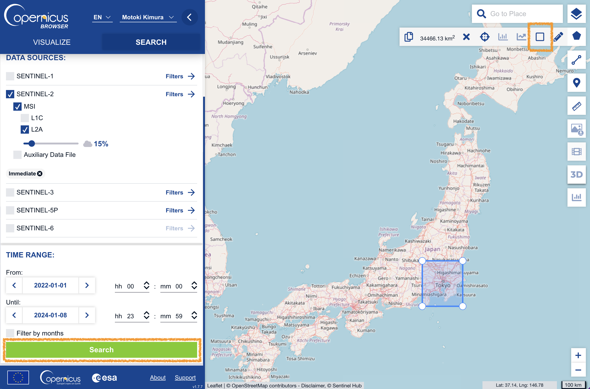
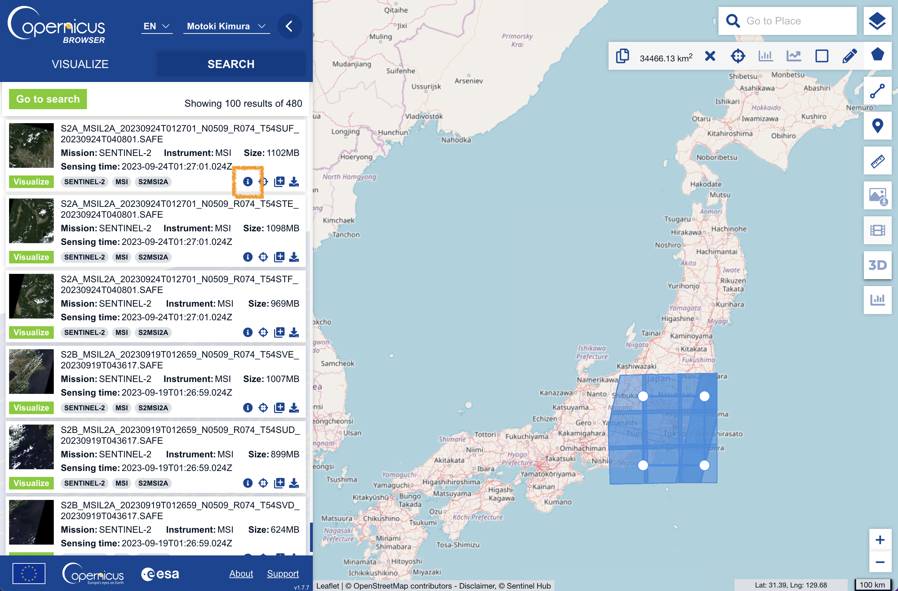
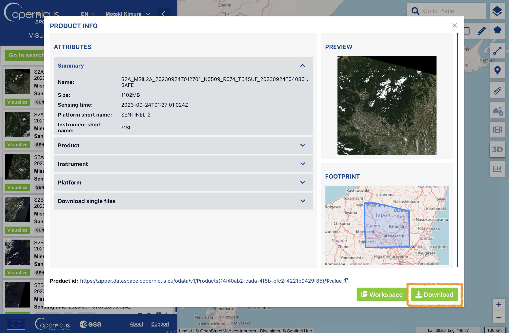
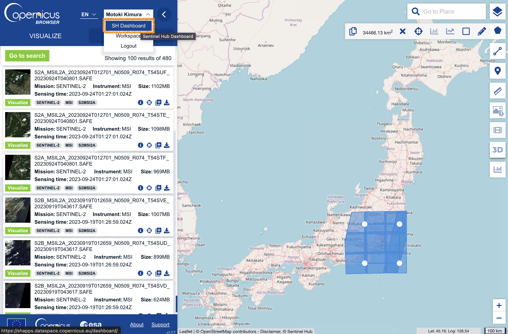

# How to download Sentinel-2 products from the Copernicus browser

This document explains how to download Sentinel-2 products from [Copernicus browser](https://dataspace.copernicus.eu/browser/), a web GUI to download Sentinel data of Copernicus Data Space Ecosystem.

### step 1: Open the Copernicus browser

Access to https://dataspace.copernicus.eu/browser/.

After signing up, click "SEARCH" tab.

### step 2: Configure the search conditions

Select "SENTINEL-2" and "L2A".

You may set cloud max cloud cover (e.g., 10% in the figure below).

Set the time period (e.g., 2022-01-01 to 2023-08-30 in the figure below).

### step 3: Configure the area of interest

In the figure below, the area of interest is set to the region around Tokyo.

Once the area of interest is set, click "Search" button to start the search.

### step 4: Select the products to download

Once the search is completed, the list of products will be shown (note that "Load more" button is available at the bottom of the page to show more products).

You can see the product information by clicking "i" button.

If you want to download the product, click "Download".

### other notes

There is a limit on the number of requests and processing units per month.

You can check the remaining number of requests and processing units by clicking "SH Dashboard".

> cf. @solafune(https://solafune.com) Use for any purpose other than participation in the competition or commercial use is prohibited. If you would like to use them for any of the above purposes, please contact us.
